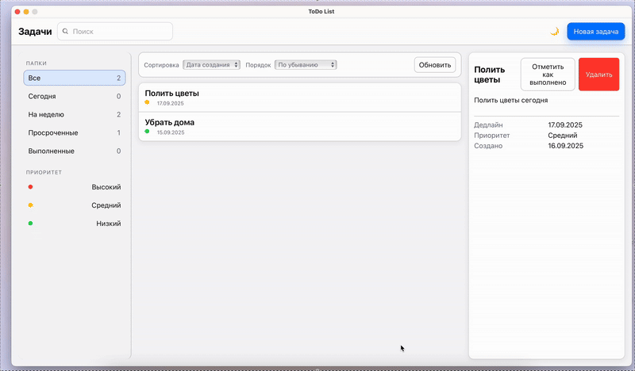
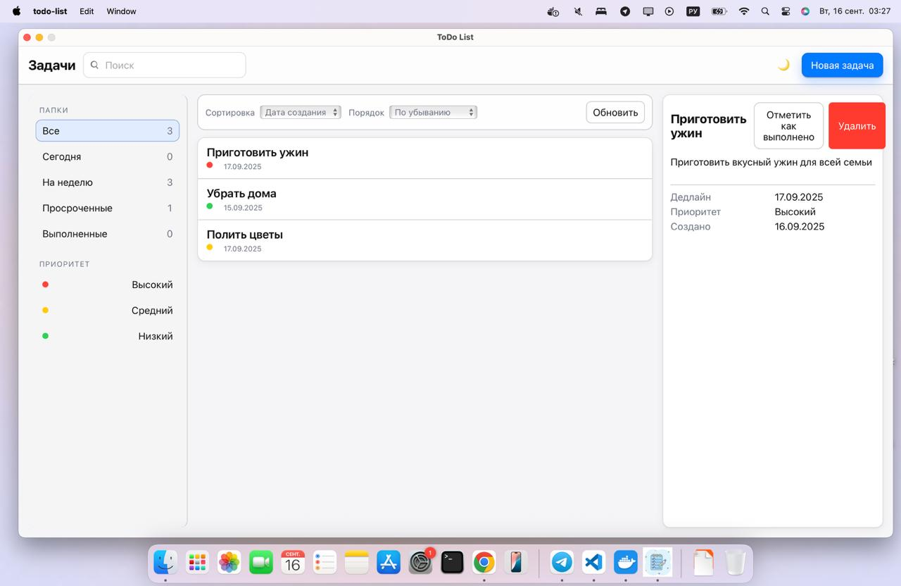
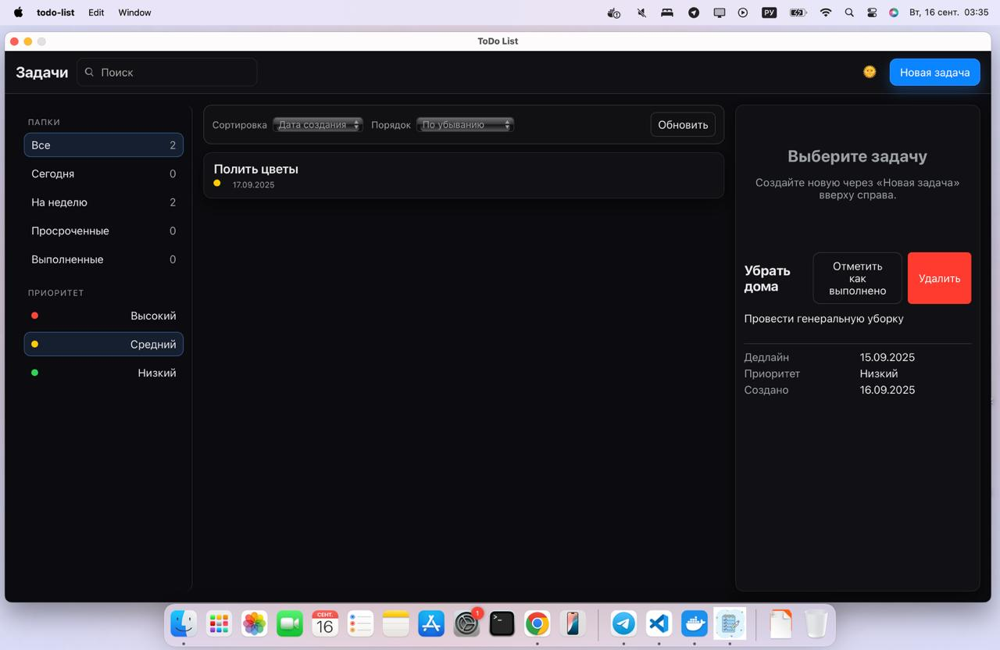
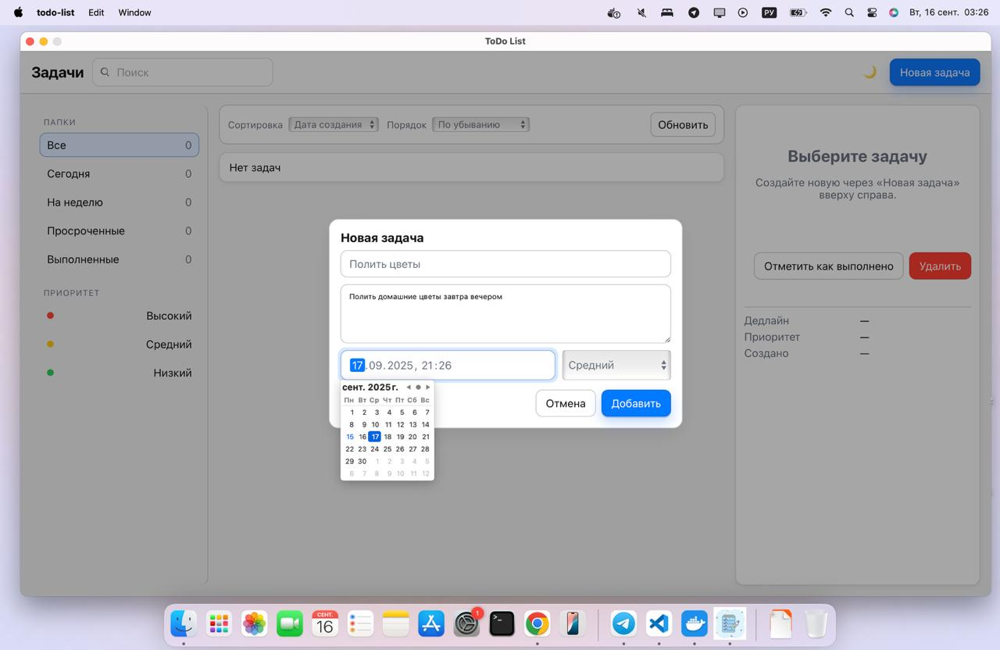
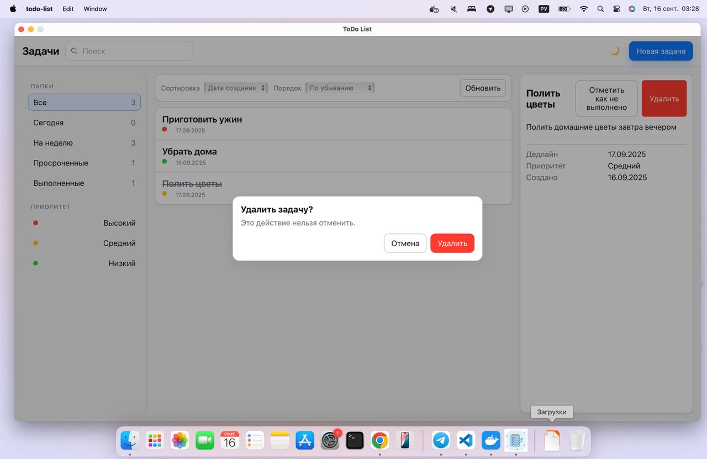
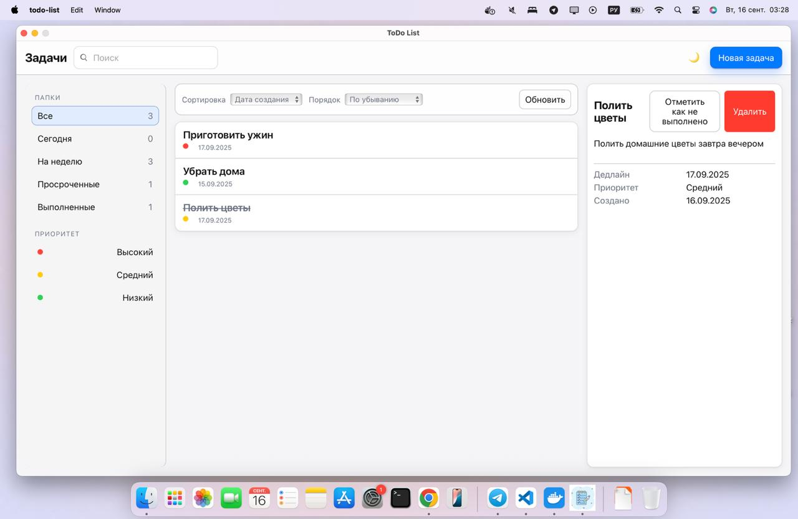
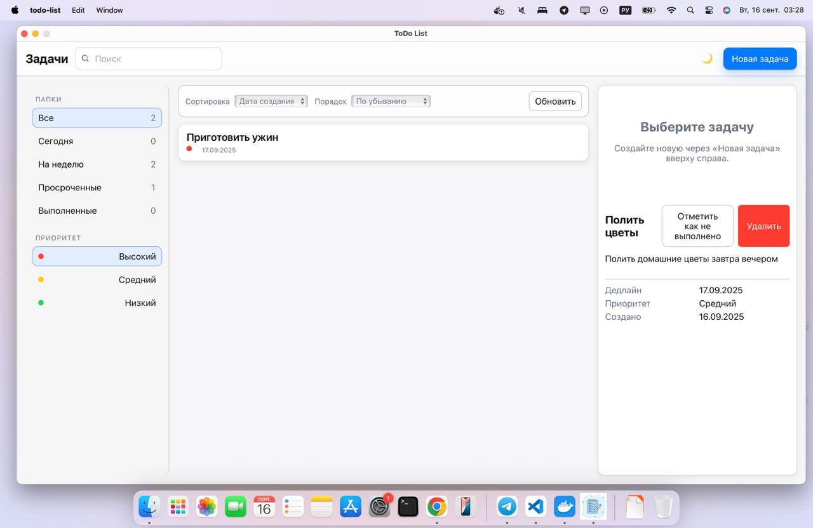
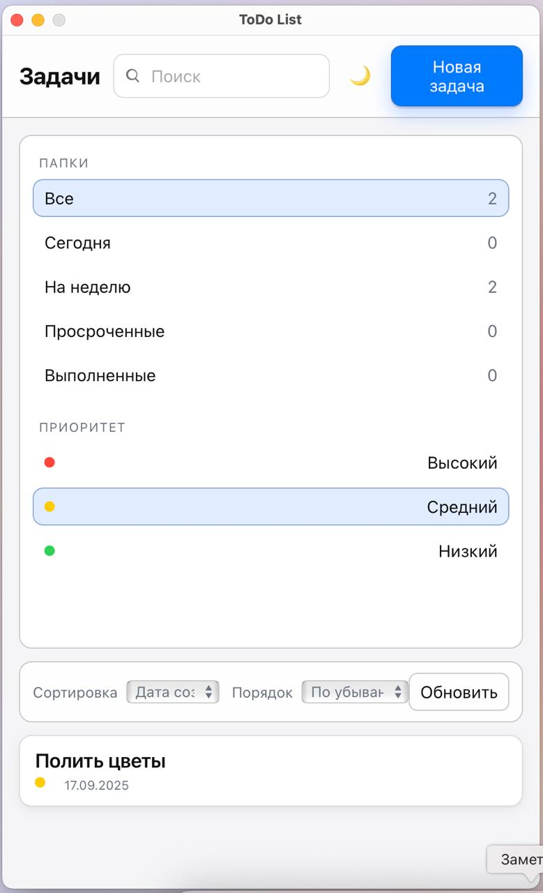

# 📝 ToDo List - Desktop Application

Современное десктопное приложение для управления списком задач, созданное с использованием фреймворка **Wails** (Go + JavaScript).

## 🚀 Технологии

Приложение построено на надежном стеке технологий: **Go** для backend логики, **Vanilla JavaScript** с CSS для frontend интерфейса, **PostgreSQL** для хранения данных и **Wails v2** как связующий фреймворк между Go и веб-технологиями.

## ✨ Реализованный функционал

### Интерфейс пользователя

Приложение имеет современный интерфейс в стиле Apple Notes с трехколоночной компоновкой. Реализована полноценная адаптивная верстка, которая корректно работает при изменении размера окна приложения. Пользователи могут переключаться между светлой и темной темами с помощью кнопки в тулбаре. Приложение автоматически определяет системные настройки темы при первом запуске.

### Управление задачами

Создание новых задач происходит через модальное окно с расширенными возможностями. Пользователь может указать заголовок, описание, установить приоритет и срок выполнения. Валидация ввода работает как на стороне клиента, так и на сервере, проверяя обязательность заголовка и корректность данных.

Все задачи отображаются в центральной панели с возможностью выбора для просмотра деталей. При отметке задачи как выполненной текст автоматически зачеркивается, а статус сохраняется в базе данных. Пользователь может в любой момент отменить отметку выполнения.

Удаление задач защищено модальным окном подтверждения, предотвращающим случайное удаление важных данных.

### Фильтрация и организация

Сайдбар содержит мощную систему фильтрации задач. Пользователи могут просматривать все задачи, только активные, выполненные, задачи на сегодня, на неделю или просроченные. Дополнительно доступна фильтрация по приоритету с цветовыми индикаторами.

Сортировка работает по дате создания, сроку выполнения или приоритету в порядке возрастания или убывания. Все фильтры и сортировка работают в реальном времени без перезагрузки интерфейса.

### Сохранение данных

Состояние всех задач надежно сохраняется в базе данных PostgreSQL. Архитектура построена по принципу Repository → Service → Handler, обеспечивая четкое разделение ответственности и легкость тестирования. При каждом запуске приложения автоматически загружается актуальное состояние задач.

## 🛠 Установка и запуск

### Подготовка окружения

Для работы приложения требуется Go версии 1.21 или выше, Node.js 16+, Wails CLI и PostgreSQL. Установите Wails CLI командой:

```bash
go install github.com/wailsapp/wails/v2/cmd/wails@latest
```

### Настройка базы данных

Создайте пользователя и базу данных в PostgreSQL:

```sql
CREATE USER todo_user WITH PASSWORD 'todo_pass';
CREATE DATABASE todo_list OWNER todo_user;
GRANT ALL PRIVILEGES ON DATABASE todo_list TO todo_user;
```

Затем создайте необходимую таблицу:

```sql
CREATE TABLE tasks (
    id SERIAL PRIMARY KEY,
    title VARCHAR(255) NOT NULL,
    body TEXT,
    done BOOLEAN DEFAULT FALSE,
    priority VARCHAR(20) DEFAULT 'medium',
    due_at TIMESTAMP NULL,
    created_at TIMESTAMP DEFAULT CURRENT_TIMESTAMP,
    updated_at TIMESTAMP DEFAULT CURRENT_TIMESTAMP
);
```

### Запуск приложения

Склонируйте репозиторий и установите зависимости:

```bash
git clone <repository-url>
cd todo-list
go mod tidy
cd frontend && npm install && cd ..
```

Для разработки используйте команду `wails dev`, для сборки релизной версии - `wails build`.

## 🏗 Архитектура проекта

### Backend структура

Backend организован по слоям с четким разделением ответственности. Слой handlers обрабатывает запросы от Wails и возвращает ответы. Services содержат всю бизнес-логику, валидацию данных и правила обработки задач. Repository абстрагирует работу с базой данных, предоставляя чистый интерфейс для операций CRUD.

Модели данных определяют структуры Task и TaskFilter, а также константы для приоритетов. Все SQL запросы параметризованы для защиты от SQL injection атак.

### Frontend решения

Интерфейс написан на чистом JavaScript без использования фреймворков для минимизации сложности и размера приложения. Состояние управляется через глобальный объект state с реактивным обновлением UI при изменениях.

CSS построен на custom properties для поддержки тем и использует современные возможности Grid и Flexbox для адаптивной верстки. Все компоненты имеют семантическую разметку и поддерживают навигацию с клавиатуры.

## 🎨 Особенности интерфейса

Дизайн вдохновлен приложением Apple Notes с его чистыми линиями и продуманной типографикой. Цветовая схема автоматически адаптируется к системным настройкам, поддерживая как светлую, так и темную темы.

Приоритеты задач отображаются цветными индикаторами: красный для высокого, желтый для среднего и зеленый для низкого приоритета. Toast уведомления информируют пользователя о результатах операций.

Модальные окна используются для создания задач и подтверждения удаления, предоставляя интуитивно понятный интерфейс без перегрузки основного экрана.

## 🔧 API методы

Приложение предоставляет четыре основных API метода: CreateTask для создания новых задач с полной валидацией входных данных, List для получения всех задач с возможностью фильтрации, SetDone для изменения статуса выполнения и DeleteTask для удаления задач из системы.

## 🚦 Решение проблем

При проблемах с подключением к базе данных проверьте статус PostgreSQL и корректность параметров подключения. Для ошибок сборки Wails убедитесь в актуальности версии CLI и отсутствии конфликтов зависимостей.

Если возникают проблемы с frontend зависимостями, удалите node_modules и package-lock.json, затем выполните чистую установку через npm install.

## 📁 Структура файлов

Проект организован логично: backend код находится в соответствующих папках по слоям архитектуры, frontend файлы сосредоточены в папке frontend, а корневые файлы содержат конфигурацию Wails и точку входа приложения.

## 📷 Демонстрация

Приложение демонстрирует современный и интуитивно понятный интерфейс во всех режимах работы.


### Светлая тема


### Темная тема  


### Создание задачи


### Удаление задачи


### Выполненная задача


### Фильтры и сортировка


### Адаптивная верстка


Видеозапись demo.mp4 демонстрирует полный цикл работы с задачами: создание, редактирование статуса, фильтрацию и удаление.

## 💻 Разработка

Код содержит подробные комментарии на русском языке, объясняющие назначение основных функций и компонентов. Backend использует принципы чистой архитектуры с четким разделением слоев. Frontend построен на модульном подходе с переиспользуемыми компонентами.

Все пользовательские действия валидируются и сопровождаются соответствующей обратной связью через toast уведомления или визуальные индикаторы состояния.


